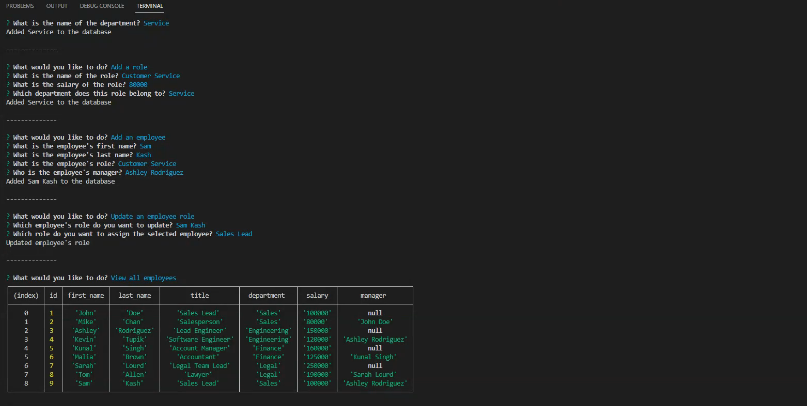

# Employee Tracker

## Description
This program allows you to track your employees, their roles, departments, salaries, and managers.

## Inistallation
This program uses Express v4.17.1, Inquirer v8.2.4, and MySQL2 v2.2.5. To install, copy and paste the following into your command line:

```sh
npm i
```

To run the program, use the following command:

```sh
node index.js
```

## Visuals
The following video shows an example of the application being used from the command line:

[](https://drive.google.com/file/d/1jl9ODzIWjxvTYu5dCPnQt5Vs_66VioHS/view)
